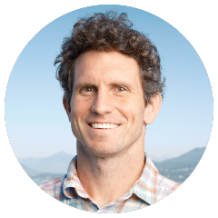
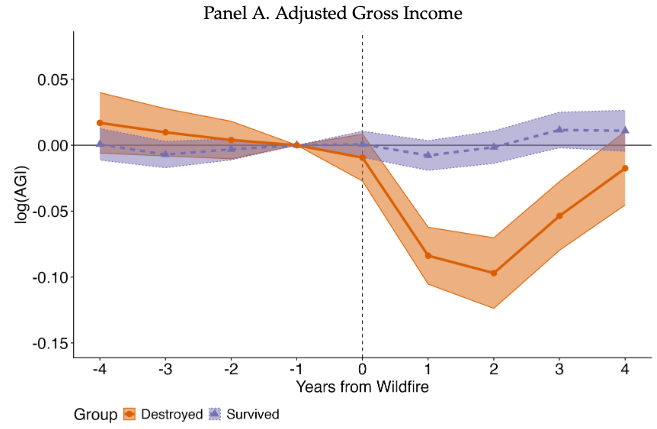
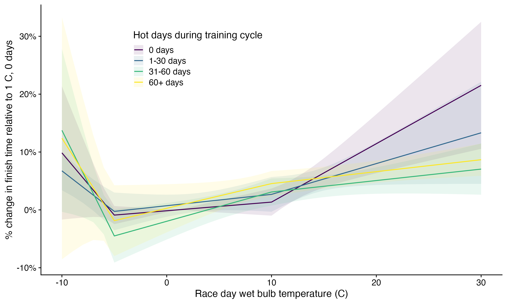

I'm an associate professor and environmental economist at the [Vancouver School of Economics](http://economics.ubc.ca/) at the [University of British Columbia](https://www.ubc.ca/) (UBC). I study how people respond to environmental threats like wildfires, air pollution, and extreme temperatures.

Some of my recent [work](research.html) includes evaluating the effectiveness of wildland building codes on home survival during wildfires, assessing the implicit subsidy of federal wildfire suppression, and measuring demand for air quality improvements in Delhi.

::: {.callout-note collapse="true"}
## New Working Paper -- **[The Distribution and Consequences of Natural Disasters: Evidence from U.S. Wildfire Victims](https://www.nber.org/papers/w35675)**

*Co-authored with Judson Boomhower, Jonathan M. Colmer, and John L. Voorheis*

Who loses their home in a wildfire, and what happens to them after? We link property-level damage data from over 100 U.S. wildfires to administrative tax and Census data to understand individual-level relationships between disaster damage and economic outcomes. Among residents exposed to a wildfire, the economic losses from wildfires are highly concentrated among those who *lose* their homes.

{width=80%}

:::

<!-- ::: {.callout-note collapse="true"} -->
<!-- ## New Working Paper -- **[Heat Adaptation in Distance Running](/pdf/running-hot.pdf)** -->

<!-- Does training in hot weather improve performance in hot weather? I use data from millions of race performances in long distance running events to find out. (Spoiler: yes.) -->

<!-- {width=80%} -->

<!-- ::: -->

Many of my projects use large datasets, natural language processing, spatial information, or all three; as a result, I do most of my data work in [R](https://www.r-project.org)/[RStudio](https://www.rstudio.com) and [Python](https://www.python.org). When not in front of my computer, you might find me [running](/img/IMG_0613.jpg), [baking sourdough](/posts/2020-04-12-bread-notes/2020-04-12-bread-notes.html), or [throwing a frisbee](/img/frisbee-montage.jpg).

Before I joined UBC, I was a postdoctoral fellow at the [Stanford Center on Food Security and the Environment](http://fse.fsi.stanford.edu/), a graduate student in [Agricultural and Resource Economics at UC-Berkeley](http://areweb.berkeley.edu), and a research assistant at the [Energy Institute at Haas](https://ei.haas.berkeley.edu). I am also a proud alumnus of [Carleton College](https://www.carleton.edu/).

<!-- If you'd like to schedule a meeting with me, you can do so [here](https://calendly.com/patrick-baylis/office-hours). -->